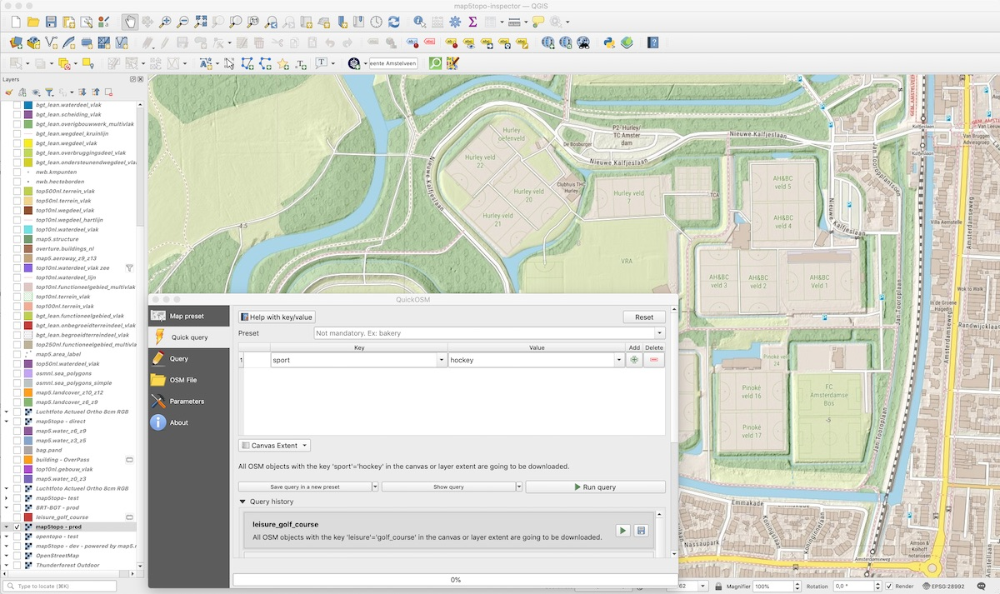
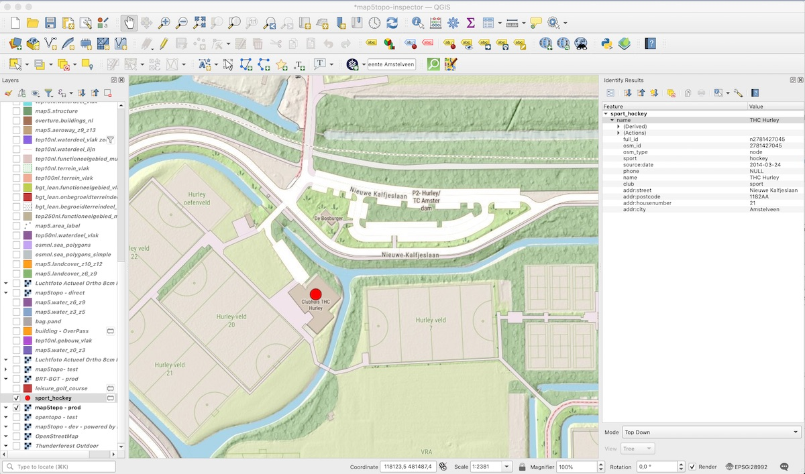

# OSM Data in QGIS

The primary method is through the [QuickOSM Plugin](https://plugins.qgis.org/plugins/QuickOSM/).  
This plugin allows you to create queries, for example, to fetch OSM data based on tags within a specific area (bbox).  
Ultimately, these queries are executed via the [OverPass API](https://wiki.openstreetmap.org/wiki/Overpass_API).

## Example

Below are two images (click on the image to enlarge). A very simple query for `sport=hockey`:

<figure markdown>
{ data-title="qgis-quickosm-query"  }
<figcaption>qgis-quickosm-query</figcaption>
</figure>

And the result:

<figure markdown>
{ data-title="qgis-quickosm-result"  }
<figcaption>qgis-quickosm-result</figcaption>
</figure>
