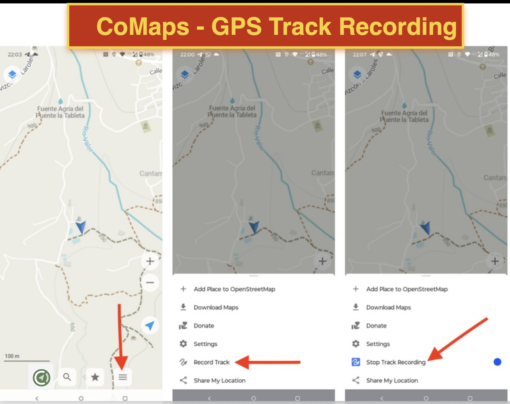
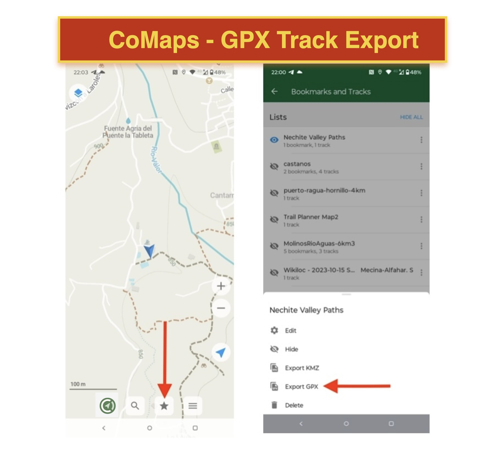

# CoMaps

[CoMaps](https://www.comaps.app/) es una de las muchas aplicaciones para usuarios finales que utiliza 100% OpenStreetMap.  
Otras aplicaciones similares que quizás conozcas: Wikiloc, AllTrails, Komoot, BackCountry Navigator, Locus,  
OSMAnd y muchas más también usan datos de OSM.

¡Atención! Waze, propiedad de Google, no está basada en OSM.

En el uso diario, CoMaps es extremadamente útil como aplicación de exterior (senderismo, ciclismo, etc.).  
Sus capacidades de navegación también son excelentes, incluso con guía por voz. También puedes cargar rutas de senderismo (archivos GPX) e
incluso grabar tus propios recorridos.

*[CoMaps](https://www.comaps.app/) es una aplicación gratuita de mapas offline para Android e iOS dirigida a viajeros, 
turistas, senderistas, conductores y ciclistas, basada en datos de OpenStreetMap creados por la comunidad.  
Es una bifurcación de código abierto, centrada en la privacidad y liderada por la comunidad, de Organic Maps](https://en.wikipedia.org/wiki/CoMaps), 
que a su vez es una bifurcación de la aplicación Maps.me (antes conocida como MapsWithMe).*

*CoMaps es una de las pocas aplicaciones que admite el 100% de sus funciones sin conexión activa a Internet.  
Instala CoMaps, descarga los mapas, apaga tu tarjeta SIM y sal de viaje durante una semana con una sola carga de batería,
sin recibir ni un solo byte de la red.*

## Navegación: Caso de uso

Especialmente en zonas rurales, CoMaps es mucho más potente. Mira este caso de enrutamiento peatonal
de un cortijo (EV) a otro (G&T). Solo CoMaps tiene toda la información sobre caminos sin pavimentar e incluso senderos de cabras para crear
la ruta más eficiente.

## Instalación

Consulta el [sitio web de CoMaps](https://www.comaps.app/).

## Uso

* Lo mejor es instalarla cuando tengas conexión WIFI o suficientes datos móviles.
* En el primer inicio, te pedirá descargar la región en la que estás, por ejemplo, Andalucía.
* A partir de ahí, ¡puedes usar la app incluso sin conexión de datos móviles!
* Primero intenta orientarte pulsando el icono de "ubicación" en la parte inferior derecha de la pantalla.
* Hay muchas opciones avanzadas. Para algunas personas, CoMaps ha sustituido a Google Maps.

## Grabación de recorridos

Una función muy potente es que puedes grabar tus propios movimientos mientras haces senderismo, vas en bici, etc.  
Esto se llama "grabación de recorridos". Incluso puedes recoger tus propios Puntos de Interés, llamados "Marcadores" mientras grabas.  
Para mantener organizadas tus grabaciones, CoMaps utiliza el concepto de "Listas". Una Lista  
es básicamente como una "carpeta" donde almacenas tus recorridos y marcadores de interés.  
Puedes encontrar tus Listas en el menú inferior pulsando el icono de la "estrella".  
Lo mejor es crear una nueva Lista antes de grabar tu recorrido.  
Los Recorridos y Marcadores siempre se graban en la "Lista actual", que es la que está arriba del todo.

Hay un video en YouTube que muestra lo básico sobre grabación de recorridos y uso de Listas.  
NB: el video usa Organic Maps, pero funciona igual en CoMaps (ya que CoMaps es un fork de OM).

Para iniciar/detener la grabación, sigue estos pasos:

* toca el ítem de menú más a la derecha en la parte inferior
* aparecerá un menú emergente con un ítem que dice "Grabar recorrido"
* toca "Grabar recorrido"
* ahora comenzará a grabar, incluso en segundo plano
* para detener la grabación, abre el mismo menú emergente, y mostrará "Detener grabación"
* preguntará si deseas guardar tu recorrido: confirma, y tu recorrido quedará grabado

Para exportar:

* pulsa el icono de menú de "estrella" en la parte inferior
* esto mostrará todas tus Listas
* toca el ítem de menú de tres puntos verticales de la Lista que deseas exportar
* aparecerá un menú
* selecciona "Exportar GPX"
* se abrirá el menú estándar de "Compartir" de tu teléfono
* ahora puedes compartirlo por tu medio favorito: Dropbox, correo electrónico, o guardarlo en un archivo local
* Consejo: una forma rápida de compartirlo contigo mismo es enviarlo por WhatsApp a ti mismo y luego abrir WhatsApp en el navegador en tu ordenador/portátil

## Editar OSM con tu traza GPS

Consulta la [sección sobre edición de OSM con trazas GPS](../advanced/gps.md). ¡Incluye un videotutorial de Justo!

## Más información

* https://en.wikipedia.org/wiki/CoMaps
* [CoMaps Taller - PDF](../assets/presentations/comaps-workshop.pdf).

**Continúa con la [Aplicación inteligente EveryDoor](everydoor.md)!**