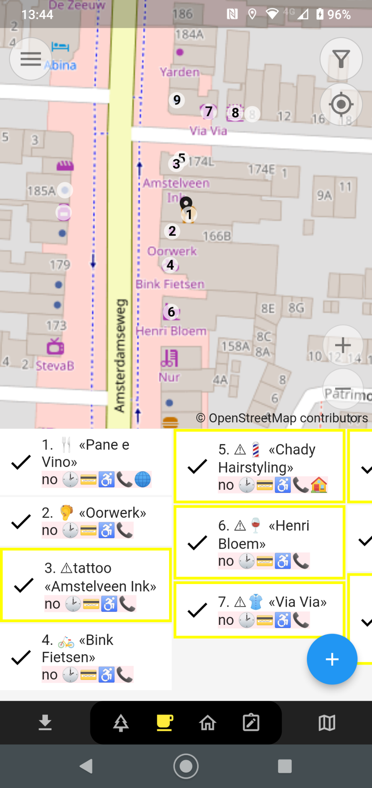

# EveryDoor App

[EveryDoor](https://every-door.app/) is an Open Source mobile phone editor designed for adding or modifying "Points of Interest" (POIs), such as shops and other facilities ("amenities"), as well as house numbers in a very user-friendly way for OpenStreetMap.

This app is specifically designed to help users keep facilities ("amenities") and shops up-to-date and to perform so-called "micro-mapping." This includes mapping details such as trees, information boards, trash bins, and fire hydrants. Not all these objects will appear on standard OSM maps, but since they are added to the large OSM database, they can be used to develop specialized maps or apps.

EveryDoor [is developed on GitHub](https://github.com/zverik/every_door) by [Ilya Zverev](https://www.openstreetmap.org/user/Zverik), a prominent OSM community member who has contributed to multiple apps and other aspects of OSM since 2010.

Ilya was also a guest in [The Great Geo Show Episode 15 - OpenStreetMap Special](https://tv.osgeo.nl/episode/episode-0015/).

## Installation

[EveryDoor](https://every-door.app/) is available for Android and iOS. See the following links:

* Android: [Google Play](https://play.google.com/store/apps/details?id=info.zverev.ilya.every_door)
* Android: [F-Droid](https://f-droid.org/packages/info.zverev.ilya.every_door/)
* iOS: [AppStore](https://apps.apple.com/app/every-door/id1621945342)

## Usage

Using the app is mostly self-explanatory.  
You need a working OSM account. 
You can enter it via the menu in the top-left corner of the main screen by opening the Configuration screen. 
At the top, you will see "OSM Account." The other settings are currently not relevant.

There is a main screen for each activity, depending on which category of objects you want to map. There are four "Modes" in total, which you can switch between using the buttons in the bottom menu, as shown below. Additionally, you can always download data from OSM using the button on the far left. If you’ve made changes, the arrow on this button will point upwards. In that case, you can use this button to upload all your changes to OSM. It’s best to save changes and send them as a single "changeset" to OSM.

<figure markdown>
{ data-title="EveryDoor: Bottom Menu" data-description="EveryDoor: Bottom Menu" }
<figcaption>EveryDoor: Bottom Menu</figcaption>
</figure>

Once you start mapping the "Download Button" will point upward. This means there are data changes you can directly upload to OSM.
NB: you need to do this explicitly, it does not happen by itself (like with StreetComplete).

### Screen 1 - Facilities - Micromapping Mode

For example, street furniture, trees, etc. Use the `+` button to add items at the location of the black marker. Shift the screen to move the black marker in place. 

<figure markdown>
{ data-title="EveryDoor: Micromapping Screen" data-description="EveryDoor: Micromapping Screen" }
<figcaption>EveryDoor: Micromapping Screen</figcaption>
</figure>

### Screen 2 - Shops, Restaurants, etc. - POI Mode

Each number on the map corresponds to a POI in the list. Use the `+` button to add items at the location of the black marker.

<figure markdown>
{ data-title="EveryDoor: Shops Screen" data-description="EveryDoor: Shops Screen" }
<figcaption>EveryDoor: Shops Screen</figcaption>
</figure>

### Screen 3 - Addresses and Buildings Mode

You can edit tags for buildings and addresses. Tap on an address or building to edit it, or use the "House" button on the bottom left or the "Address" 
button on the bottom right.  
Use the black marker to select the address/building. This has the same effect as tapping.

<figure markdown>
{ data-title="EveryDoor: Addresses and Buildings Screen" data-description="EveryDoor: Addresses and Buildings Screen" }
<figcaption>EveryDoor: Addresses and Buildings Screen</figcaption>
</figure>

### Screen 4 - Notes Mode

Here, you can add a standard [OSM Note](https://wiki.openstreetmap.org/wiki/Notes) tied to a location.  
Use the blue "Note" button on the bottom right to add a note at the location of the black marker.  
This is a very powerful tool to add various indicators for yourself or others, such as errors you encounter but cannot fix in EveryDoor, or as a "reminder" for yourself to fix something later using another editor, such as iD or JOSM.  
You can find your own notes in your profile on openstreetmap.org.

<figure markdown>
{ data-title="EveryDoor: Notes Screen" data-description="EveryDoor: Notes Screen" }
<figcaption>EveryDoor: Notes Screen</figcaption>
</figure>

Here are some additional links that might help with using the app:

* [OSM Wiki Every_Door](https://wiki.openstreetmap.org/wiki/Every_Door)  
* [Tutorial Session by Ilya in Tanzania - Video](https://www.youtube.com/watch?v=q7OscecqUJY)

## Video Introduction by Ilya Zverev

**Continue to the [Smart App StreetComplete](streetcomplete.md)!**
