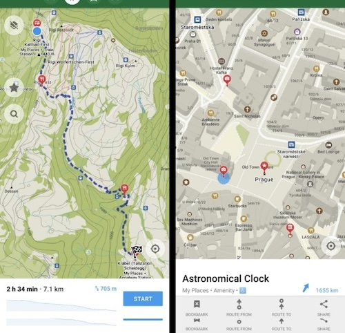
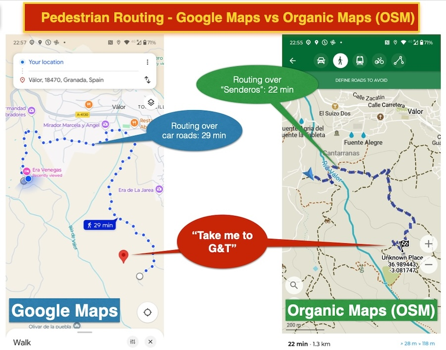
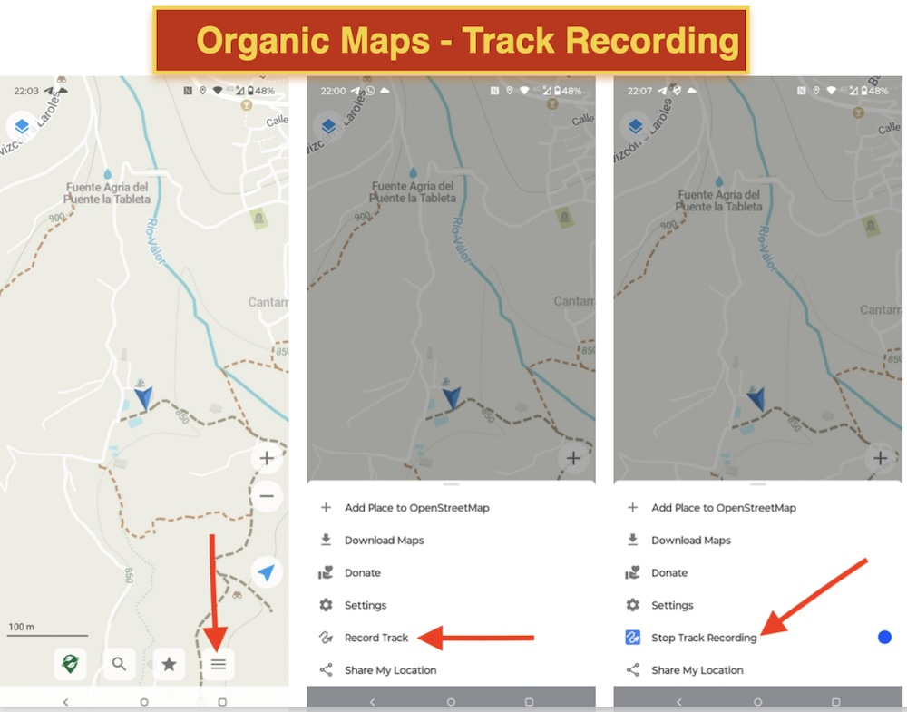
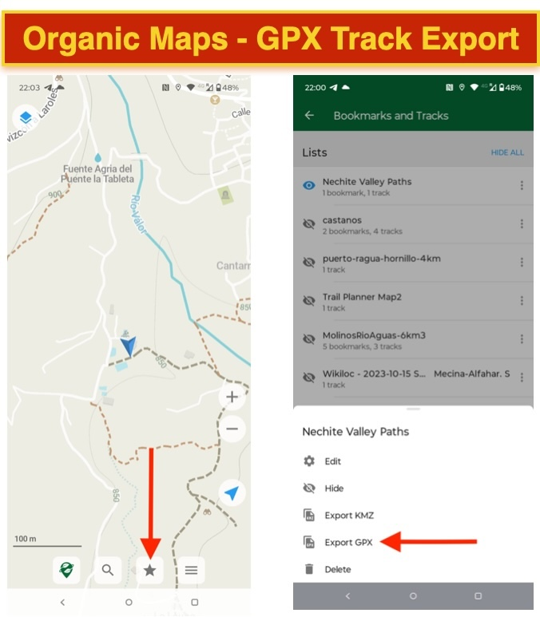

# Organic Maps

[Organic Maps](https://organicmaps.app/) is one of the many "end-user apps" that uses 100% OpenStreetMap.
Other similar apps you may know: Wikiloc, AllTrails, Komoot, BackCountry Navigator, Locus, 
OSMAnd and many more also use OSM data.

Beware: Waze, owned by Google, is not an OSM-based app!

In daily usage Organic Maps is extremely handy to use as an outdoor (hiking, biking etc.) app. 
Its navigation capabilities are excellent as well, even voice-powered. You can also load hiking routes (GPX files) and
even record your own traces. 

*[Organic Maps](https://organicmaps.app/) is a free Android & iOS offline maps app for travelers, 
tourists, hikers, drivers and cyclists based on OpenStreetMap data created by the community. 
It is a privacy-focused, open-source fork of Maps.me app (previously known as MapsWithMe), 
maintained by the same people who created MapsWithMe in 2011.*

*Organic Maps is one of the few applications nowadays that supports 100% of features without an active Internet connection. 
Install Organic Maps, download maps, throw away your SIM card, and go for a weeklong trip on a single battery charge without any 
byte sent to the network.*

Source: [Organic Maps](https://organicmaps.app/) .

## Navigation: Use case 

Especially in rural areas, Organic Maps is much more powerful. See this case of pedestrian routing
from one 'cortijo' (EV) to another (G&T). Only Organic Maps has all the info on tracks and even goat paths to create
the most efficient route.

## Installation

See [organicmaps.app website](https://organicmaps.app/)

## Usage

* Best is to install while you are on a WIFI or have ample mobile data
* On first launch it will ask you to download the region you are in, e.g. Andalusia
* From then on you can even use the app without mobile data switched on!
* First try to orient by pushing the "location" icon at lower right of screen
* There are many advanced options, for some people Organic maps has replaced Google Maps

## Recording Tracks

A very powerful feature is that you can record your own movements while hiking, cycling etc. 
This is called "track recording". You can even collect your own Points of Interest, called "Bookmarks" while recording. 
To keep your track recordings organized Organic Maps has a concept of "Lists". A single List
is basically like a "folder" in which you store your tracks and bookmarks of interest. You will find
your Lists via the bottom menu by pressing the "star" icon. Best is to create a fresh new List before recording your track.
Tracks and Bookmarks are always recorded in the "current List", which is the one on the top.

There's a YouTube video which shows the basics of track recording and dealing with Lists.

To start/stop recording follow these steps:

* tap the menu item at the far-right on bottom
* this brings up pop-up menu with an item that says "Record Track"
* tap "Record Track"
* no it will keep recording, even in the background
* to stop recording, bring up the same pop-up menu, and it shows "Stop Recording"
* it will as if you like to Save your track: confirm, and your track is recorded

To export:

* press the "star" menu icon in the bottom
* this will show all yout Lists
* tap the far left menu item (three vertical dots) of your target List
* this brings up a menu
* select "Export GPX"
* that brings up your phone's standard "Share" menu
* now you can share via your favorite medium, like Dropbox, even by email, or to a local file on your phone
* Tip: a handy way to share to yourself quickly: share via WhatsApp to yourself and then open WhatsApp in your browser on your computer/laptop

## Edit OSM with your GPS trace

See [section on editing OSM with GPS traces](../advanced/gps.md). This includes a video tutorial by Just!

## More info

* https://en.wikipedia.org/wiki/Organic_Maps

**Continue to the [Smart App EveryDoor](everydoor.md)!**
