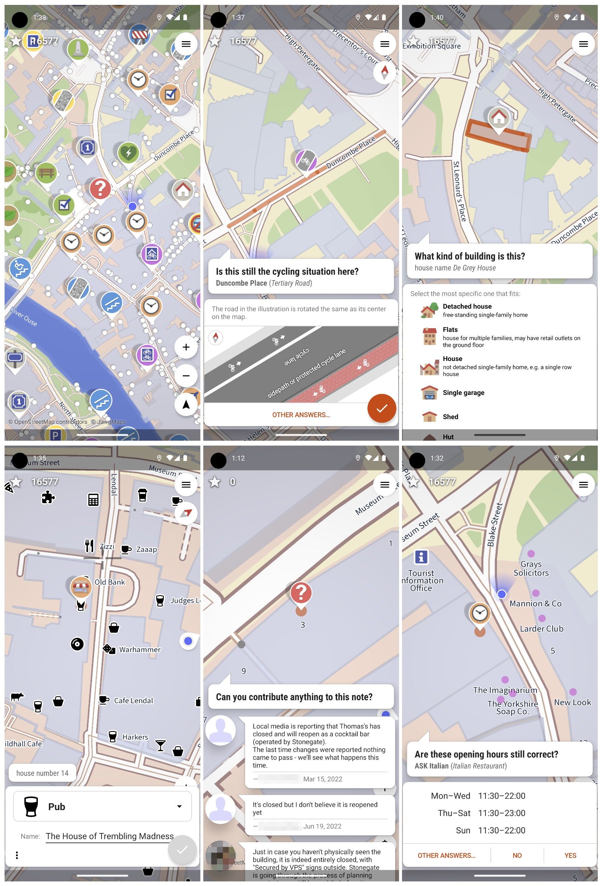

# StreetComplete App

*"[StreetComplete](https://streetcomplete.app/?lang=en) is an easy-to-use editor for OpenStreetMap designed for Android phones and tablets. 
It is used for field surveying.*

*The app is specifically designed for casual contributors and beginners, as no prior knowledge of OpenStreetMap 
(such as tagging schemas) is required to contribute with the app. Additionally, the app features some gamification 
and statistics to introduce and encourage users to explore the world of OpenStreetMap further."*

Source: [OSM Wiki](https://wiki.openstreetmap.org/wiki/StreetComplete).

StreetComplete was originally created by [Tobias Zwick](https://wiki.openstreetmap.org/wiki/User:Westnordost) and later developed further with the help of [many contributors](https://github.com/streetcomplete/StreetComplete/graphs/contributors).

## Installation

StreetComplete is only available for Android (via Google Play or F-Droid).  
Follow the link here:

* [StreetComplete Home](https://streetcomplete.app/?lang=en)

## Documentation

There isn’t an official manual, but the app is intuitive. However, there are several sources of information, which we’ve gathered here:

* [The README](https://github.com/streetcomplete/StreetComplete/blob/master/README.md)
* [A FAQ](https://wiki.openstreetmap.org/wiki/StreetComplete/FAQ)
* [StreetComplete on OSM Wiki](https://wiki.openstreetmap.org/wiki/StreetComplete)
* [SC Forum/QA on GitHub](https://github.com/streetcomplete/StreetComplete/discussions)

## Usage

First, check out the [README](https://github.com/streetcomplete/StreetComplete/blob/master/README.md) in English:

StreetComplete (SC) automatically looks for nearby places where additional information is needed. These are presented as "quests" on the map.  
SC displays these "quests" as markers on the map. Each of these quests can be resolved on-site by answering a simple question.  
For example, by tapping on a marker, you might be asked, "What is the name of this street?" and presented with a text field to answer. More examples are shown in the screenshots below.

<figure markdown>
{ data-title="StreetComplete Screenshots" data-description="Source: https://github.com/streetcomplete/StreetComplete" }
<figcaption>StreetComplete Screenshots - Source: https://github.com/streetcomplete/StreetComplete</figcaption>
</figure>

The user’s answers are automatically processed and uploaded directly to the OSM database.  
Edits are submitted in meaningful changesets using the user’s OSM account.  
Since the app is designed for field use, it can also work offline (via Settings) and is optimized to minimize data usage.

To make the app user-friendly, the quests are limited to those that can be answered through simple questions.  
Here is the [list of possible quests](https://wiki.openstreetmap.org/wiki/StreetComplete/Quests).

!!! tip

    Sometimes you’ll encounter a situation in the field that you cannot resolve directly in StreetComplete. For example, a walking path might have been removed, or a building has been demolished.  
    In such cases, you can leave location-bound Notes (and even photos) and later resolve them at home using an OSM editor like iD or JOSM. Don’t forget to "resolve" the Note afterward!  
    How to create a Note? Within SC, do a "long press" with your finger on the spot where you want to leave the Note. Alternatively, you can choose "Other Answers... | Don’t Know" in the quest and create the Note there.  
    [Here you can view the latest Notes in the Netherlands](https://resultmaps.neis-one.org/osm-notes-country?c=Netherlands), or see your own Notes in your User Profile when logged into openstreetmap.org.

### Team Mode

There is a Team Mode for cases where multiple people are surveying the same street and want to avoid overlapping work.  
This mode might be tested during the workshop.
