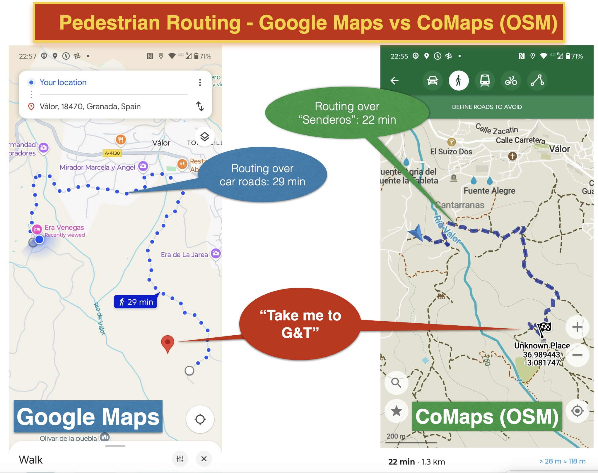

# ¡Bienvenido al Taller de OpenStreetMap!

[OpenStreetMap](https://openstreetmap.org), abreviado como "OSM", es un mapa gratuito y editable de todo el mundo creado por voluntarios. 
OSM a veces se denomina "La Wikipedia de los mapas". Es posible que ya utilices OSM
a través de alguna de las muchas "aplicaciones" como Komoot, Strava, Wikiloc o AllTrails.

## ¿Cuándo es el taller?

Por ahora bajo demanda. Consulta la sección ['cuándo'](when.md)

## ¿Por qué este taller?

OSM es importante para regiones como la Alpujarra (¡y el mundo en general!) ya que puede ofrecer mucho más detalle que, por ejemplo, Google Maps, incluso para navegación/ruteo. Consulta el ejemplo a continuación.

OSM puede empoderar a las comunidades, ya que pueden mapear su entorno en lugar de depender
de proveedores comerciales de mapas. También en casos de desastres como el reciente [DANA en Valencia](https://wiki.openstreetmap.org/wiki/ES:Espa%C3%B1a/Humanitario/DANA_2024), 
es importante tener mapas precisos y/o poder [mapear rápidamente la región en conjunto](https://tasks.hotosm.org/projects/17948).

OSM también encaja en el actual [movimiento Public Stack como alternativa a las 'Big Tech'](https://publicstack.net/alternatives/). La palabra clave aquí es **Empoderamiento**.

## Acerca de este taller

En este taller aprenderás a usar
las distintas "aplicaciones móviles" para mapear tu entorno. 
No se requiere conocimiento previo ni experiencia técnica. 
Después de una introducción, saldremos a mapear calles y negocios locales juntos. 
Ven con tu smartphone. Un portátil es útil pero no necesario.

Lo que aprenderás:

- Los conceptos básicos de OSM, su modelo de datos y el "etiquetado"
- Navegar por [openstreetmap.org](https://openstreetmap.org)
- [Crear una cuenta en OSM](https://www.openstreetmap.org/user/new)
- Jugar con [CoMaps](https://www.comaps.app/), una de las muchas aplicaciones de usuario impulsadas por OSM para smartphones
- Mapear con aplicaciones inteligentes como [StreetComplete](https://streetcomplete.app/?lang=nl) y [EveryDoor](https://every-door.app/)
- Conocer a la [comunidad mundial](https://community.openstreetmap.org/) y a la [comunidad española de OSM](https://openstreetmap.es)

Todo a su debido tiempo. Normalmente este taller dura unas 4 horas. El objetivo es empoderarte 
como mapeador/a en tu pueblo o región, con suerte como colaborador/a habitual. 

Un portátil es útil, pero todo el taller puede hacerse con tu smartphone.

## Materiales del curso

Este taller incluye diapositivas, que puedes encontrar 
[en formato PDF aquí](presentation.md).

También utilizamos tutoriales existentes de OSM como:

- [Guía para principiantes de OSM en la Wiki](https://wiki.openstreetmap.org/wiki/Beginners%27_guide)
- El sitio web [LearnOSM](https://learnosm.org/nl_NL/)

Las [diapositivas de la presentación](presentation.md) sirven como guía principal. 
Este sitio web y las diapositivas también se pueden usar como material de referencia o para autoaprendizaje.

## Temas avanzados

El enfoque principal de este taller está en las "aplicaciones inteligentes".  
Si el tiempo lo permite, los participantes pueden explorar temas más avanzados, incluyendo:

- Extracción de datos de OpenStreetMap usando la API OverPass (Turbo)
- Extracción de datos de OpenStreetMap en QGIS
- Introducción a los editores ID y JOSM
- Control de calidad usando herramientas como [Osmose](https://wiki.openstreetmap.org/wiki/Osmose)
- Específico para [España: importar edificios y direcciones](https://wiki.openstreetmap.org/wiki/Spanish_Cadastre/Buildings_import), "Edificios y Direcciones", desde el "Catastro"

# Sobre este taller

Este taller fue desarrollado inicialmente y presentado en la [Conferencia OSGeo.nl FOSS4GNL 2023 en Middelburg, Países Bajos](https://foss4g.nl), 
y traducido y ampliado para talleres en la región de la Alpujarra (España), en torno a la ciudad de Válor, por Just van den Broecke.

Nos gustaría ofrecerlo también en otros lugares. ¡Háznoslo saber si estás interesado!  Además: ¡se agradecen contribuciones y traducciones al español!

La licencia es Creative Commons CC0 1.0 Universal. Esto significa que eres libre de usar este material cumpliendo con la licencia CC0.

El contenido está [desarrollado en GitHub](https://github.com/justb4/alpumapa.xyz).  
Si notas algún error o tienes sugerencias, puedes enviarlas como *issues* o *pull requests* (PRs) en GitHub.

## Tu facilitador del taller

| [Just van den Broecke](https://www.openstreetmap.org/user/justb)  |
|---|
|   |

(Buscando refuerzos...)

**¡Vamos a empezar con [Los conceptos básicos](intro.md)!**