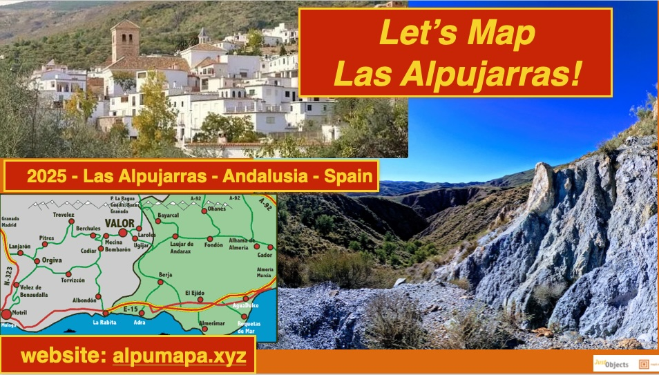

 
# Welcome to the OpenStreetMap Alpumapa Workshop!

[OpenStreetMap](https://openstreetmap.org), abbreviated as "OSM", is a free, editable map of the entire world built by volunteers. 
OSM is sometimes called "The Wikipedia of Maps". You may already use OSM
via one of the many "apps" like Komoot, Wikiloc or AllTrails. 

## Why this Workshop?

OSM is important for regions
like the Alpujarra since it can provide much more detail than for example Google Maps.
OSM can empower communities since they are able to map their surroundings instead of relying
on commercial map providers. Also in cases of disasters like recently [DANA in Valencia](https://wiki.openstreetmap.org/wiki/ES:Espa%C3%B1a/Humanitario/DANA_2024), it is important
to have accurate maps and/or be able to [jointly quickly map the region](https://tasks.hotosm.org/projects/17948).

In this workshop you will learn how to use
the various "apps" to map your surroundings. 
No prior knowledge nor technical background is required. 
After an introduction we go out to map streets and local businesses together. 
Come with your smartphone. A laptop is handy but not required.

!!! Tip

    Buscamos traduitores...OpenStreetMap, abreviado como "OSM", es un mapa gratuito y editable de todo el mundo creado 
    por voluntarios. OSM a veces se denomina "La Wikipedia de los mapas". Es posible que ya utilices OSM
    a través de alguna de las muchas "aplicaciones" como Komoot, Wikiloc o AllTrails.
    
    OSM es importante para regiones como la Alpujarra, ya que puede proporcionar muchos más detalles que, por ejemplo, 
    Google Maps. OSM puede empoderar a las comunidades, ya que pueden mapear sus alrededores en lugar de depender
    de proveedores de mapas comerciales. También en casos de desastres como el reciente DANA en Valencia, es importante
    tener mapas precisos y/o poder mapear rápidamente la región juntos.
    
    En este taller aprenderás a usar las distintas "aplicaciones" para mapear tus alrededores.
    No se requieren conocimientos previos ni experiencia técnica.
    Después de una introducción, saldremos a mapear calles y negocios locales juntos.
    Ven con tu teléfono inteligente. Una computadora portátil es útil, pero no es necesaria.

## About this workshop

This is a basic workshop where you will learn:

- The basics of OSM, its data model, and "tagging"
- Navigating [openstreetmap.org](https://openstreetmap.org)
- [Creating an OSM account](https://www.openstreetmap.org/user/new)
- Play with [Organic Maps](https://organicmaps.app/), one of the many OSM-driven user-apps for smartphones
- Mapping with smart OSM surveyor apps: [StreetComplete](https://streetcomplete.app/?lang=nl) and [EveryDoor](https://every-door.app/)
- Meet the [worldwide](https://community.openstreetmap.org/) and [Spanish OSM community](https://openstreetmap.es)

All in due time, normally this workshop takes about 4 hours. The goal is to empower you 
as a mapper in your village/region, hopefully as regular contributor. 

A laptop is handy, but this entire workshop can be done with your smartphone.

## Course materials

This workshop includes presentation slides, which you can find 
[here as a PDF](assets/presentations/osm-workshop-alpumapa-2025-v1.pdf).

We also utilize existing OSM tutorials such as:

- [OSM Beginner's Guide Wiki](https://wiki.openstreetmap.org/wiki/Beginners%27_guide)
- The [LearnOSM](https://learnosm.org/nl_NL/) website

The [presentation slides](assets/presentations/osm-workshop-alpumapa-2025-v1.pdf) serve as the main guide. 
This website and the slides can also be used as reference material or for self-study.

## Advanced Topics

The focus of this workshop is primarily on the "smart apps."  
If time permits, participants can explore more advanced topics, including:

- Extracting data from OpenStreetMap using the OverPass (Turbo) API
- Extracting data from OpenStreetMap in QGIS
- Introduction to the ID and JOSM Editors
- Quality assurance using tools like [Osmose](https://wiki.openstreetmap.org/wiki/Osmose)
- Specific to [Spain: importing Buildings and Addresses](https://wiki.openstreetmap.org/wiki/Spanish_Cadastre/Buildings_import), "Edificios y Direcciones", from "Catastro"

# About This Workshop

This workshop was developed initially and presented at the [OSGeo.nl FOSS4GNL 2023 Conference in Middelburg, The Netherlands](https://foss4g.nl), 
and translated and extended for workshops within the Spanish Alpujarra region around the city of Válor by Just van den Broecke.

We can imagine offering it at other places as well. Let us know if you're interested!  Also: contributors and Spanish translations welcome!

The license is Creative Commons CC0 1.0 Universal. This means you are free to use this material in compliance with the CC0 license.

The content is [developed on GitHub](https://github.com/justb4/alpumapa.xyz).  
If you notice any errors or have suggestions, you can submit them as issues or pull requests (PRs) on GitHub.

## Your Workshop Provider

| [Just van den Broecke](https://www.openstreetmap.org/user/justb)  |
|---|
|   |

(Looking for enforcements...)

**Let's start with [The Basics](intro.md)!**
