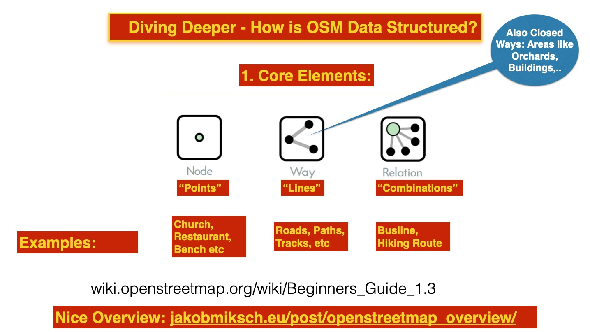
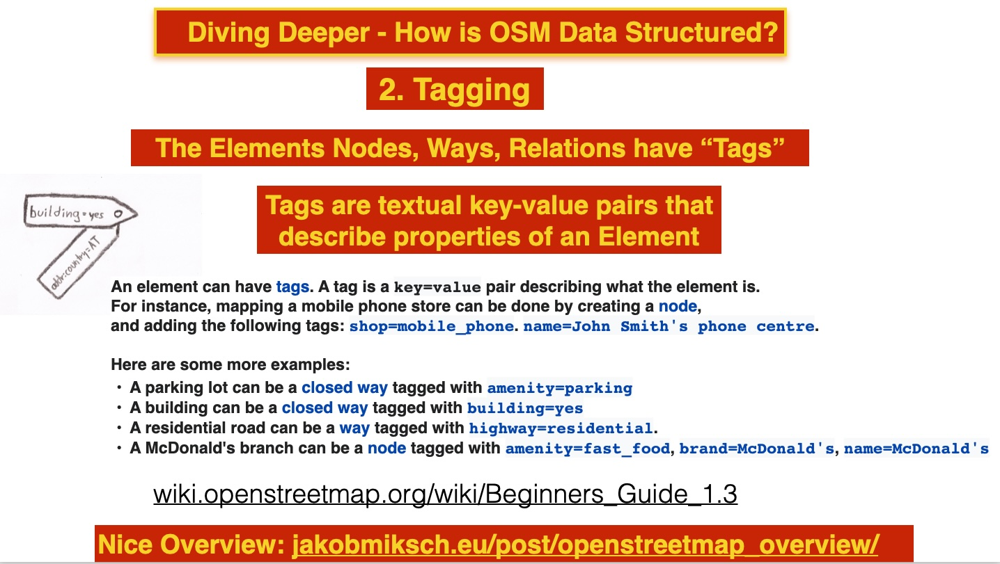
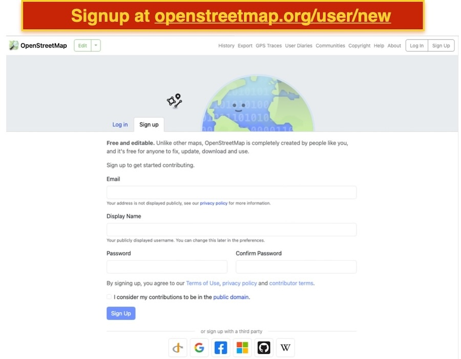
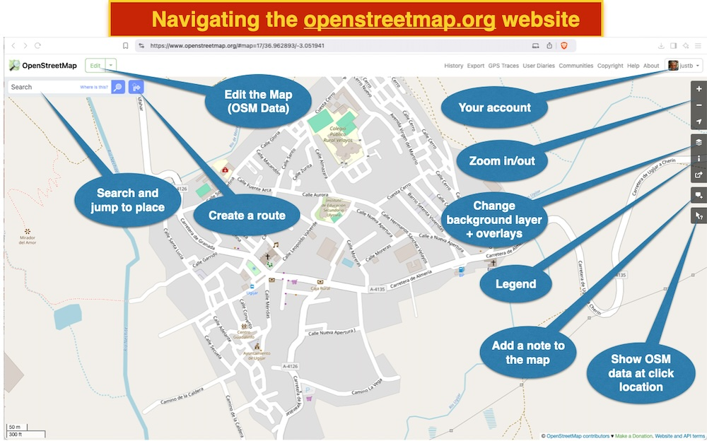
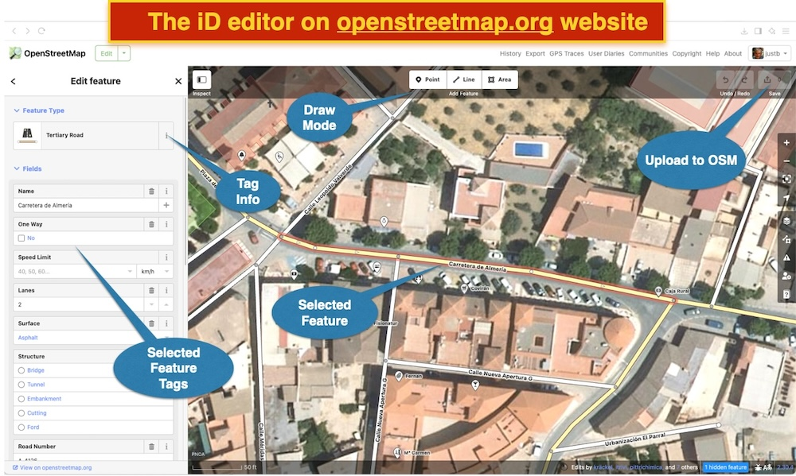

# Fundamentos de OSM

Esta sección explica los principios básicos de OSM.

## Historia

OpenStreetMap fue fundado en 2004 por [Steve Coast](https://stevecoast.com/).  
Lee más en la [Historia de OpenStreetMap](https://wiki.openstreetmap.org/wiki/History_of_OpenStreetMap).

## Explorando el sitio web de OpenStreetMap

[Empieza con OSM en LearnOSM](https://learnosm.org/en/beginner/start-osm/)

## El modelo de datos de OSM

Consulta [Comprendiendo los datos de OSM](https://wiki.openstreetmap.org/wiki/Beginners_Guide_1.3).

En el modelo de datos de OSM, las geometrías son fundamentales.  
Piensa en puntos, líneas, áreas y combinaciones de estas.

Estas geometrías se llaman **Elementos** en OSM.  
A cada elemento se le asignan propiedades, a veces llamadas metadatos, en forma de **Etiquetas**.

Los elementos en la terminología de OSM son:

* **[Nodo](https://wiki.openstreetmap.org/wiki/Node)** (piensa: puntos)  
* **[Camino](https://wiki.openstreetmap.org/wiki/Way)** (piensa: líneas)  
* **[Camino cerrado](https://wiki.openstreetmap.org/wiki/Way#Closed_way)** y **[Área](https://wiki.openstreetmap.org/wiki/Way#Area)** (piensa: áreas abiertas o rellenas, polígonos)  
* **[Relación](https://wiki.openstreetmap.org/wiki/Relation)**, combinaciones de elementos, por ejemplo, rutas de senderismo. No trataremos esto aquí.  
* Cada elemento tiene un **[Id único de 64 bits](https://wiki.openstreetmap.org/wiki/64-bit_Identifiers)**.

En lugar de modelos y esquemas con atributos, como en GML, OSM utiliza **etiquetado**:

* Cada elemento (ver arriba) se describe con una o más **etiquetas**.  
* Una etiqueta es un par `clave=valor`.  
* Por ejemplo, para un camino: `highway=residential` o para un aparcamiento (camino cerrado): `amenity=parking`.  
* Dentro de OSM, hay consenso "en curso" vía la [Wiki](https://wiki.openstreetmap.org/wiki/Tags) sobre el conjunto de etiquetas a usar.  
* Algunos editores OSM, como iD, usan preajustes para facilitar el uso.  
* Consulta la [explicación detallada](https://wiki.openstreetmap.org/wiki/Tags).  
* OSM reconoce implícitamente las [Características del Mapa](https://wiki.openstreetmap.org/wiki/Map_features) mediante el etiquetado.
* Consulta las [Directrices de etiquetado](https://wiki.openstreetmap.org/wiki/ES:Directrices_de_etiquetado_espa%C3%B1olas) para reglas específicas en España.

!!! tip

    El sitio/app TagInfo en [taginfo.openstreetmap.org](https://taginfo.openstreetmap.org/) proporciona información detallada sobre el uso de etiquetas.  
    Las etiquetas usadas específicamente en España están en [taginfo.geofabrik.de/europe/spain](https://taginfo.geofabrik.de/europe/spain).  
    Pero lo mejor es buscar en la [Wiki de OSM](https://wiki.openstreetmap.org/wiki/Main_Page).  
    Cada etiqueta, ya sea clave o par clave=valor, está documentada allí.  
    Por ejemplo, escribiendo 'mercado' te lleva a: [amenity=marketplace](https://wiki.openstreetmap.org/wiki/Tag:amenity%marketplace).

## Crear una cuenta

Pedimos a los participantes que lo hagan con antelación (por correo electrónico) para ahorrar tiempo.  
El registro es fácil vía [www.openstreetmap.org/user/new](https://www.openstreetmap.org/user/new).  
No es necesario usar tu nombre real como nombre de usuario, también llamado "identificador OSM". Se puede cambiar después.  
Además, tu ubicación de inicio no tiene que ser tu dirección real. También puede modificarse luego.

## Navegar en openstreetmap.org

Este es el sitio principal. Una vez que hayas iniciado sesión, estarás en el mapa por defecto con algunos 
iconos y menús, como se muestra en la imagen abajo. ¡Te animamos a explorar por ti mismo!

## Editar con el editor iD (navegador)

Este, "iD", es el editor por defecto en openstreetmap.org.  
Cuando [inicies sesión](https://www.openstreetmap.org/login), verás un botón 'Editar' en la esquina superior izquierda. Al hacer clic, se abrirá el editor iD.  
El mapa de fondo cambiará entonces, generalmente a la imagen aérea más detallada.  
En España, esta es la [imagen aérea PNOA del IGN](https://pnoa.ign.es/) de alta resolución. [ign.es también tiene un mapa topográfico](https://www.ign.es/web/ign/portal/), ¡pero está desactualizado!

Solo cubriremos lo básico del editor iD.

!!! tip

    Puedes añadir un mapa de fondo personalizado en iD, por ejemplo, desde Catastro. Ve a Capas y luego "Personalizado..."  
    En un formulario puedes insertar una URL simbólica, por ejemplo, una capa de los mapas catastrales.  
    Aquí tienes un ejemplo de la capa de edificios del "Servicio Web de Mapas Catastrales de la Dirección General del Catastro según el perfil INSPIRE":
    `https://ovc.catastro.meh.es/cartografia/INSPIRE/spadgcwms.aspx?REQUEST=GetMap&SERVICE=WMS&VERSION=1.3.0&FORMAT=image/png&TRANSPARENT=true&LAYERS=BU.Building&CRS={proj}&STYLES=&WIDTH={width}&HEIGHT={height}&BBOX={bbox}`
    Pero atención: la importación de edificios y direcciones en España debe hacerse siguiendo las 
    [Directrices de importación](https://wiki.openstreetmap.org/wiki/Spanish_Cadastre/Buildings_import).

## Comunidad

* [Foro de OSM](https://community.openstreetmap.org)
* [Comunidad Española en el Foro de OSM](https://community.openstreetmap.org/c/communities/es/51)
* [Página de España en la Wiki de OSM](https://wiki.openstreetmap.org/wiki/ES:Espa%C3%B1a)
* [Grupo de Telegram de OpenStreetMap España](https://www.t.me/OSMES)
* [ideandalucia.es](https://www.ideandalucia.es/portal/) - ¡muchos mapas interesantes de Andalucía!

El canal principal de comunicación para la comunidad española es su [grupo abierto en Telegram](https://www.t.me/OSMES).

!!! tip

    Con tu cuenta OSM, automáticamente tienes acceso al foro de OSM.

## Explora los resultados del mapeo

Hay varias formas de ver qué has añadido tú y otras personas en OSM. Aquí tienes dos sitios para explorar:

- [simon04.dev.openstreetmap.org/whodidit](https://simon04.dev.openstreetmap.org/whodidit/?zoom=13&lat=37.00356&lon=-3.07891&layers=BTT&age=1%20month) - haz clic en los rectángulos
- [overpass-api.de/achavi](https://overpass-api.de/achavi/?zoom=16&lat=36.96261&lon=-3.05341&layers=0000B00TTTTT) (introduce una fecha pasada)

Lo revisaremos al volver del ejercicio.

## Más información

* [Wiki de OSM](https://wiki.openstreetmap.org/)  
* [Empieza con OSM en LearnOSM](https://learnosm.org/en/beginner/start-osm/) (la versión en inglés está ligeramente más actualizada)

**Continúa con [CoMaps](apps/comaps.md)!**