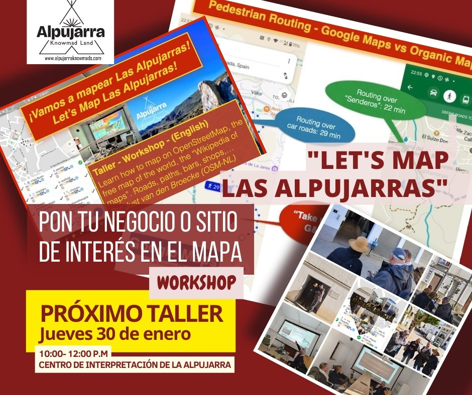

# ¿Cuándo es el taller?
Por ahora, bajo demanda. Info/contacto: osm@justobjects.nl.

## FOSS4G-NL 2023 - Middelburg

Una versión temprana se [llevó a cabo en el FOSS4G-NL el 13 de septiembre de 2023](https://2023.foss4g.nl/workshops/#session-126).

## Alpujarra

El taller se impartió varias veces en enero y febrero de 2025 en el [Ayuntamiento de Ugíjar](https://www.ugijar.es/inicio/)  
Detalles en el [Calendario de OpenStreetMap](https://osmcal.org/event/3417/).

## Maptime Ámsterdam

[Lun, 4 de agosto · 16:45 CEST Maptime Ámsterdam: Mapear y Conocer](https://www.meetup.com/maptime-ams/events/309055084/)

## Ayuntamiento de Válor

* Cuando: 6 y 9 de agosto, 2025
* Tiempo: a la mañana 10:00-13:00
* Donde: Aula de Formación (al lado del Ayuntamiento de Válor)
* Maestro: Just "Justo" van den Broecke - Cuesta Viñas

El municipio de Válor está en la provincia de Granada, Andalucía, España.
