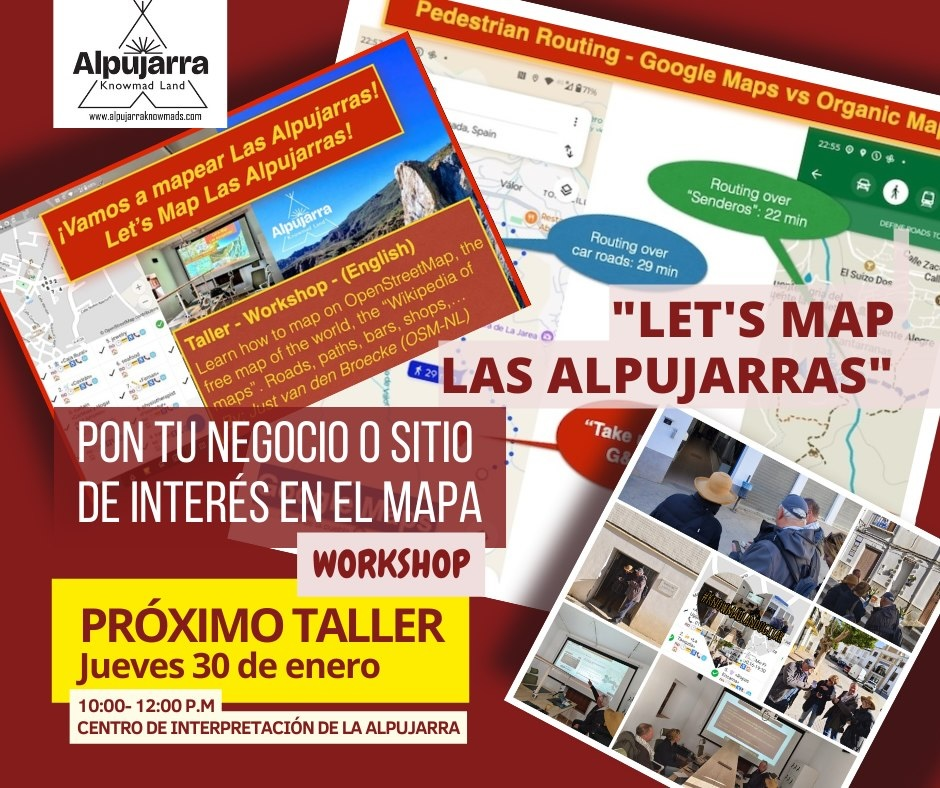

 
# When is the Workshop?
For now on demand. Info/contact: osm@justobjects.nl.

## FOSS4G-NL 2023 - Middelburg 

An early version was [held at the FOSS4G-NL September 13, 2023](https://2023.foss4g.nl/workshops/#session-126).

## Alpujarra 

Workshop was provided several times in January and February, 2025 at [Ayuntamiento de Ugíjar](https://www.ugijar.es/inicio/)
Details on [OpenStreetMap Calendar](https://osmcal.org/event/3417/).

## Maptime Amsterdam

[Mon, Aug 4 · 4:45 PM CEST Maptime Amsterdam: Map & Meet](https://www.meetup.com/maptime-ams/events/309055084/)

## Ayuntamiento de Válor

We expect to hold this workshop again in September 2025 at 
[Ayuntamiento de Válor](https://www.openstreetmap.org/node/5588139457), the townhall of the municipality of Válor 
in province of Granada, Andalusia, Spain.

