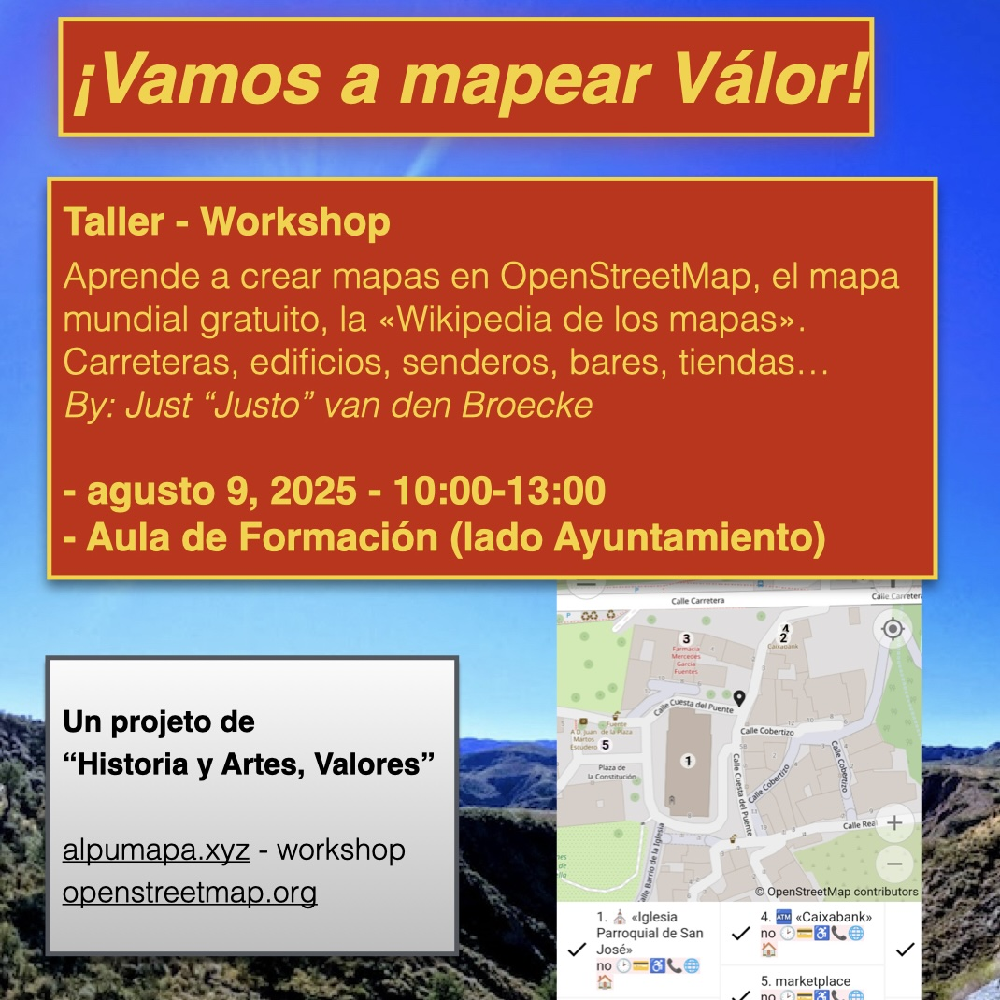

 
# When is the Workshop?
For now on demand. Info/contact: osm@justobjects.nl. Latest editions first:

## Válor - Spain - Feb 8, 2026

Workshop how to install and use the [OpenStreetMap CoMaps mobile app](https://www.comaps.app/).

* Where: [Bar El Suizo](https://www.openstreetmap.org/?mlat=36.996351&mlon=-3.085109#map=19/36.996351/-3.085109&layers=N).
* Time: 10:30 AM - 1:00 PM

The municipality of Válor is in the province of Granada, Andalusia, Spain.

## Maptime Amsterdam - Oct 3, 2025

[Fri, Oct 3 Maptime Amsterdam: Map & Meet](https://www.meetup.com/maptime-ams/events/310744695)

## Válor - Spain - Sept 2025

This workshop was held again in September 2025, 
near the [Ayuntamiento de Válor](https://www.openstreetmap.org/node/5588139457).

* When: September 6 and 9, 2025
* Time: Morning, 10:00 AM - 1:00 PM
* Where: Training Room (next to Valor Town Hall)
* Instructor: Just "Justo" van den Broecke - Cuesta Viñas

The municipality of Válor is in the province of Granada, Andalusia, Spain.

## Maptime Amsterdam - Aug 4, 2025

[Mon, Aug 4 · 4:45 PM CEST Maptime Amsterdam: Map & Meet](https://www.meetup.com/maptime-ams/events/309055084/)

## Alpujarra - Ugíjar - Jan/Feb 2025

Workshop was provided several times in January and February, 2025 at [Ayuntamiento de Ugíjar](https://www.ugijar.es/inicio/)
Details on [OpenStreetMap Calendar](https://osmcal.org/event/3417/).

## FOSS4G-NL Middelburg - 2023 

An early version was [held at the FOSS4G-NL September 13, 2023](https://2023.foss4g.nl/workshops/#session-126).
